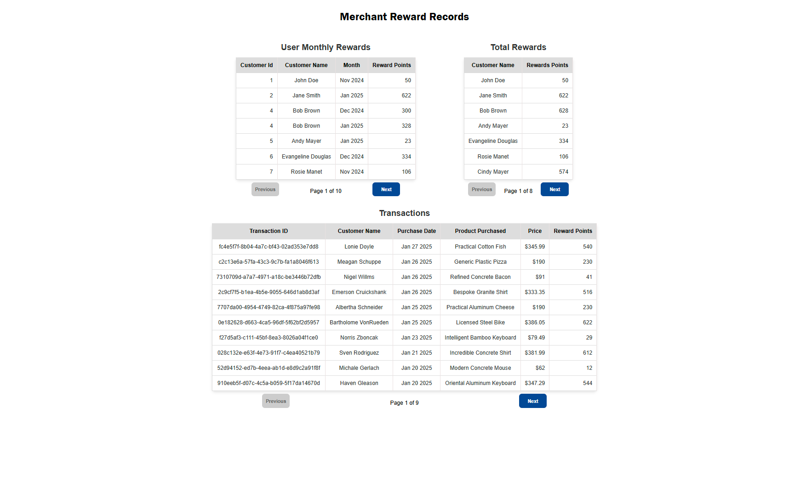
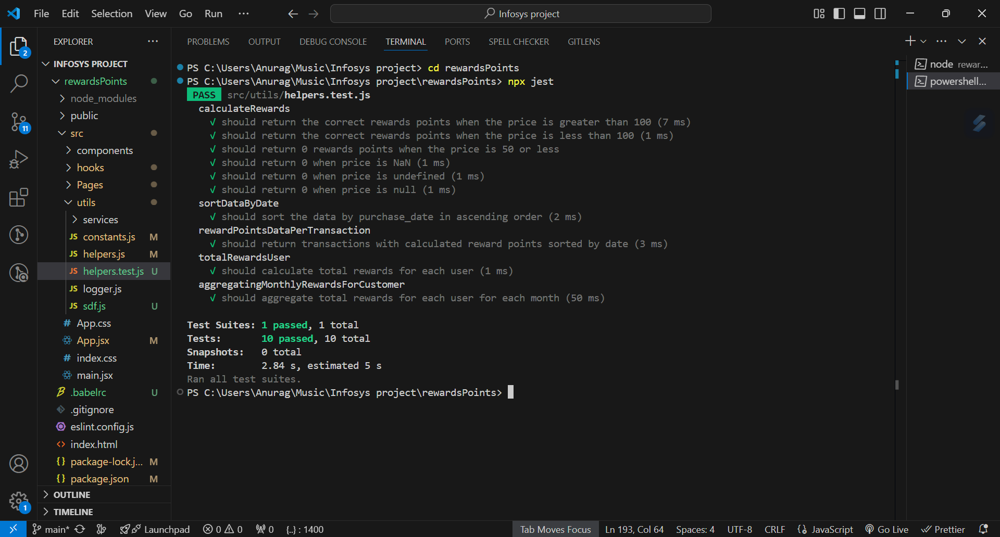

# 🛍️ Merchant Rewards Page

This project is all about displaying the **Rewards** earned by each customer in the **last 3 months**, sorted from the oldest to the latest date. 🚀

---

## 📊 What's Inside?
We have **3 tables** to meet the requirements, and each table comes with **pagination** for smooth navigation when there are more than 10 records. ✨

---

1. 🌀 **Repeated Customers:** An array of objects keeps track of repeated customers (as they are common in any store).
2. 🎲 **Randomized Data:** We randomly determine if a customer is repeated or new.
3. 🆕 **New Customer Addition:** If the customer is new, they are added to the array with a unique customer ID.
---

## 🖥️ The Three Tables
Each table is implemented as a **pure component** for modularity and reusability. Here's a quick breakdown:

### 1️⃣ **Transaction Table**
- **Columns:** 
  - Transaction ID
  - Customer Name
  - Purchase Date
  - Product Purchased
  - Price
  - Reward Points for Each Transaction
- **Purpose:** Displays all transactions (duplicates included) for the last 3 months.

### 2️⃣ **User Monthly Rewards Table**
- **Columns:**
  - Customer ID
  - Customer Name
  - Month of Purchase
  - Reward Points
- **Purpose:** Aggregates records for each customer to show their rewards for the month of their most recent purchase.

### 3️⃣ **Total Rewards Table**
- **Columns:**
  - Customer Name
  - Reward Points
- **Purpose:** Summarizes the total reward points for each customer.

---

## 🔄 Pagination Made Easy
To avoid redundant code, we use a **custom hook** `usePagination.jsx`. This hook handles all pagination logic for the tables. Here's what it offers:

- 🧮 **Inputs:**
  - `data`: The dataset to paginate.
  - `itemsPerPage`: Number of records per page (10 for the Transaction Table, 7 for the rest).

- 🔑 **Returns:**
  - `currentPage`: The current page number.
  - `totalPages`: Total number of pages.
  - `changePage`: Function to handle page navigation (next/previous buttons).
  - `paginatedData`: Sliced data for the current page.
  - `updatePaginatedData`: Updates the data when needed.

---

### 🛠️ Technologies Used
- **React** for UI
- **CSS Modules** for styling

---

Test-Cases
To Run Test use Command: npm test or npx jest

Hope you enjoy exploring this project! 🎉 If you have any questions or suggestions, feel free to reach out. 🤝

